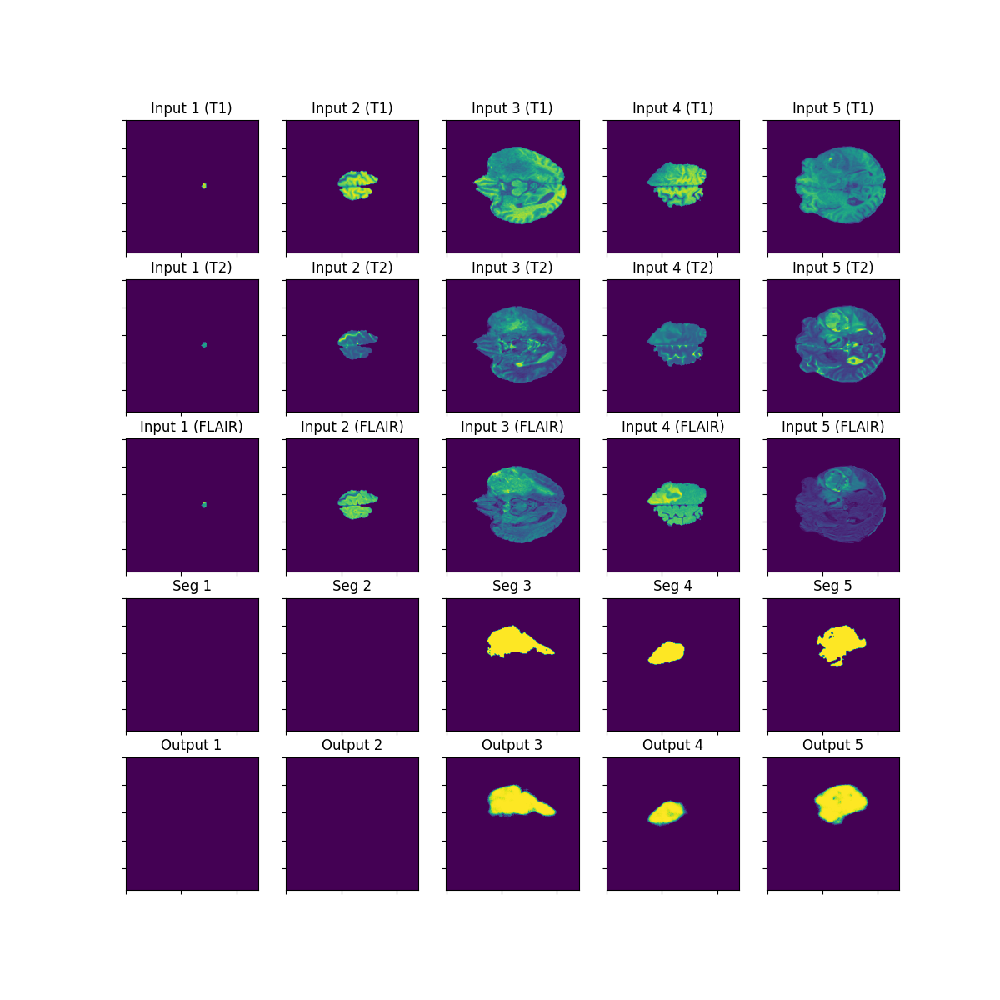

# MRISeg
Re-trainable MRI image segmentation model with Metal Performance Shader acceleration.
Model is based on original [SegNet Paper](https://arxiv.org/pdf/1511.00561.pdf)
## Training Data
The data used for training the initial model is the BraTS2020 data found here:
[BraTS2020](https://www.kaggle.com/datasets/awsaf49/brats20-dataset-training-validation?rvi=1)

## Metal Performance Shaders
This system was designed to be accelerated using Apple silicon
and the metal performance shaders. The default device can be changed to cpu.

### Benchmarks
Initial benchmarking shows approximately a 6x speedup using MPS on
M2 Pro with 32GB ram.

## Base Segmentation
The base segmentation model is designed to segment MRI images from the BraTS2020 dataset.
This primarily consists of Gliomas. The training uses T1, T2 and FLAIR sequences as input and a
a binary segmentation mask as the target. The original dataset includes T1CE images, however
in its current for the model doesn't utilize them for training. This might be a reasonable inclusion,
however more investigation is necessary to ascertain whether there is enough of an information advantage.

### Example Training Segmentation
At baseline random weights produces a segmentation pattern that is essentially noise.
An example of the untrained net can be found below.

After approximately one epoch the model begins to classify and segment images accurately, however
with poor spatial resolution.
